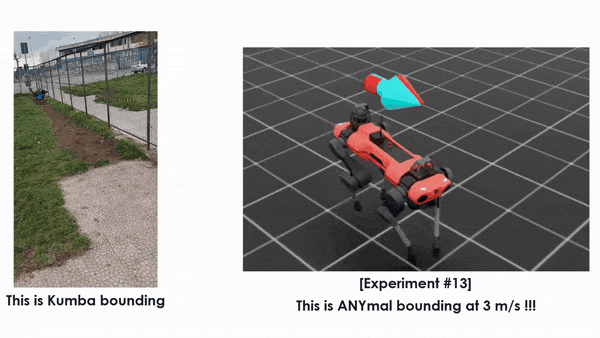
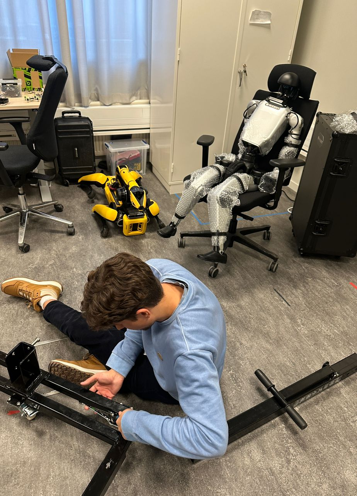

  

  
  
  # Hi! I'm William Notaro 👋
  
  **Robotics & Embodied AI**
  
  Visiting Student Researcher at **KTH Royal Institute of Technology** | Honors Student at **Scuola Superiore Meridionale**
  
  
  
  

---

### 🚀 About Me
I'm a Master’s student in **Automation Engineering and Robotics** bridging the gap between **Generative AI** and **Safety**. 

- 🎯 **Currently working on:** Imitation Learning for Bimanual Mobile Manipulation at **KTH**.
- 🔭 **Research focus:** Foundation Models for Robotics, Sim-to-Real Transfer, Formal Verification.

---

### 🔬 Featured Research & Projects

#### 🤖 A VLM-based Control Framework with Plan Verification - ([repo](link))
*MSc Thesis Project | Supervisor: Prof. A. Finzi*

**The Challenge:** Enabling robots to handle open-world instructions ("Pick up the object that looks like...") while ensuring safety.
* **Method:** Integrated **Vision-Language Models** for semantic reasoning with **PDDL** (Planning Domain Definition Language) for formal plan verification.
* **Result:** Deployed on a real **Franka Research 3**. Achieved **<4mm reprojection error** in grounding.
* **Tech:** ROS 2, Python, PDDL, VLM (Gemini Robotics-ER 1.5).

> [!TIP]
> **Check the Full Video Demo:** [YouTube Video](https://youtu.be/C8rL8y8n__4)
> 
> 

 

#### 🐕 Dynamic Gait Learning via Reinforcement Learning - ([repo](https://github.com/well-iam/biologically-inspired-anymal))
*Advanced Robotics Project | 2025*

**The Challenge:** Training a quadruped robot to execute dynamic gaits in simulation.
* **Method:** Utilized **Isaac Lab** (NVIDIA) and **Reinforcement Learning** (PPO) to train a locomotion policy.
* **Result:** Achieved stable bounding gait at **3 m/s** on ANYmal-C model with 42 min estimated autonomy.
* **Tech:** NVIDIA Isaac Lab, PyTorch, RL.

**

 

#### 🦾 Imitation Learning for Bimanual Mobile Manipulation
*Visiting Researcher @ KTH | Present*

**The Challenge:** Coordinating the Unitree G1 Humanoid for Deformable Object Manipulation.
* **Method:** Investigating **Hybrid Action Spaces** in Imitation Learning to solve long-horizon manipulation tasks.
* **Context:** Working under the supervision of **Prof. Danica Kragic**.

---

### 🛠️ Technical Stack

| Area | Tools & Frameworks |
| :--- | :--- |
| **Robotics Middleware** |   |
| **AI & Learning** |    |
| **Languages** |    |
| **DevOps & Tools** |   |

---

  <small>Last update: Feb 2026 | Based in Stockholm, Sweden 🇸🇪</small>

